# hiu
## akmal
### Tugas-Program
#### belajar program sederhana
##### Program Python Nilai Data Mahasiswa , UTS, UAS, Tugas

Program python daftar mahasiswa dan perhitungan nilai 3 komponen (Tugas: 30&, uts:35%, uas:35%)'
'

1. Ruang Lingkup Program'
'
- Sintaks Dasar Python
- Operator Logika
- Percabangan
- Perulangan
- List & Tuple
- String & Bilangan
- Fungsi'
'
2. Rancangan Tampilan Input & Output'
'
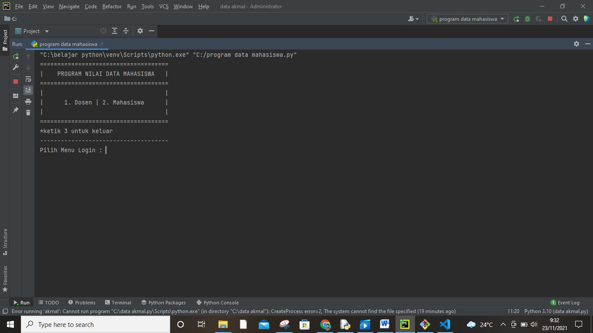
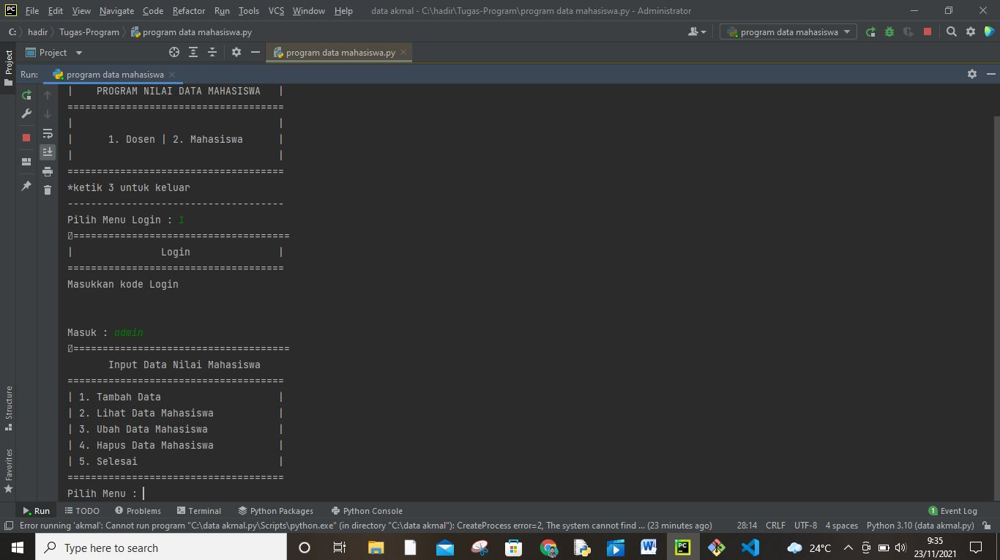

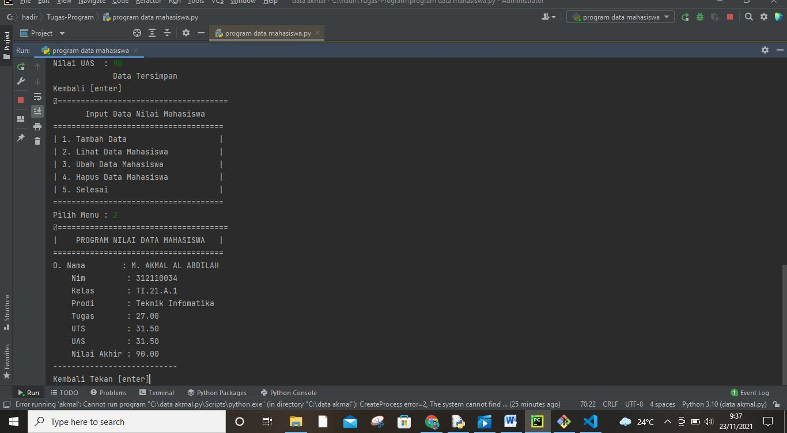
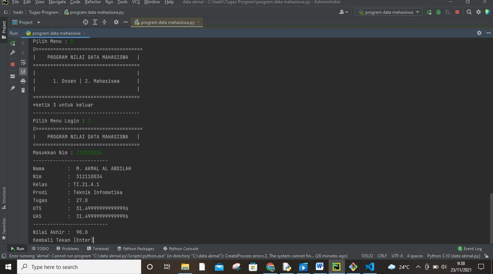
3. Alur Program atau Diagram Flowchart'
'
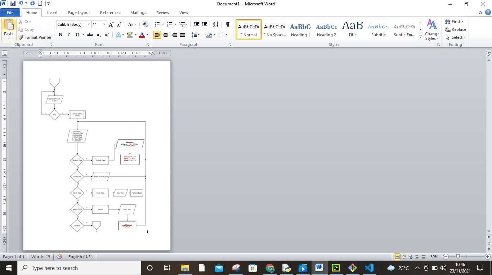
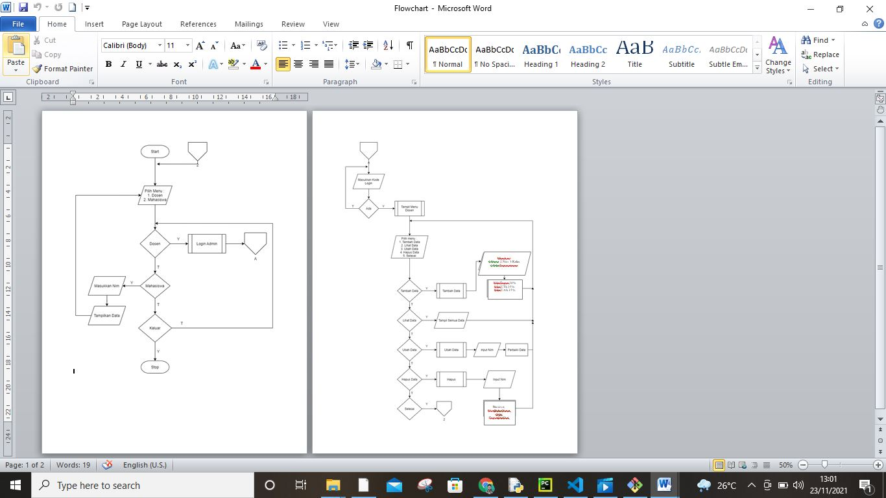
4. Ketentuan Soal'
'
Tampilkan Menu halaman utara dengan pilihan : (Dosen dan Mahasiswa)
Menampilkan menu login Dosen dengan masukan kode (password = admin) untuk melanjutkan ke menu dosen.
Tampilkan menu Pilihan jika memilih menu dosen : ( Tambah Data, Lihat Data, Ubah Data, Hapus data)
Nilai Akhir diambil dari perhitungan 4 komponen nilai yaitu :         
Tugas          : 30%
UTS            : 35%
UAS            : 35%
Meliputi data (Nama,Nim,kelas,Prodi,Komponen nilai akhir)
Menampilkan Output di Menu Mahasiswa berupa (Nama, Nim, Kelas, Prodi, Komponen Nilai akhir)'
'
5. Coding Program'
'
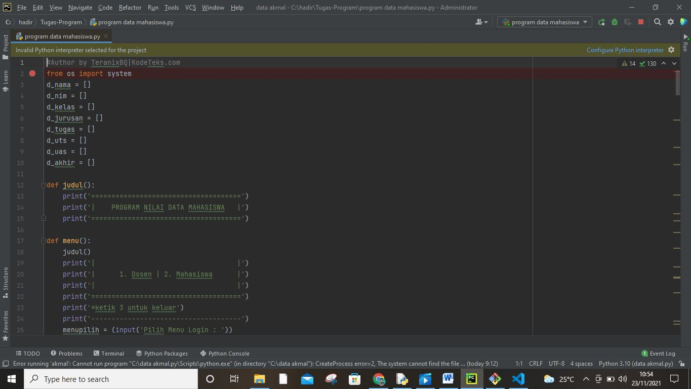
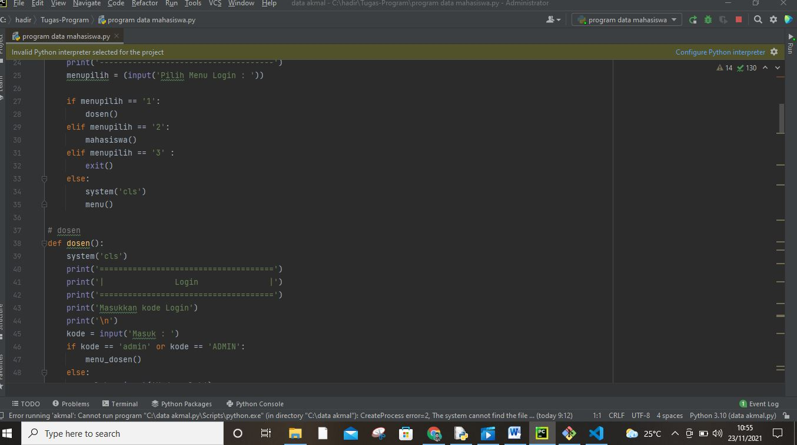
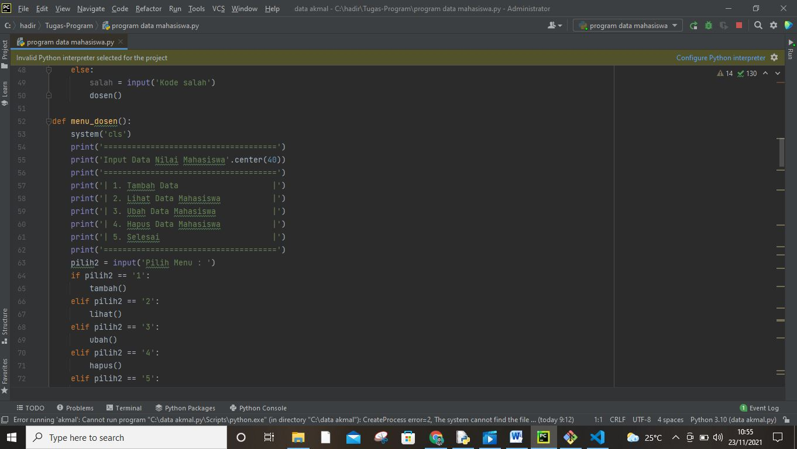
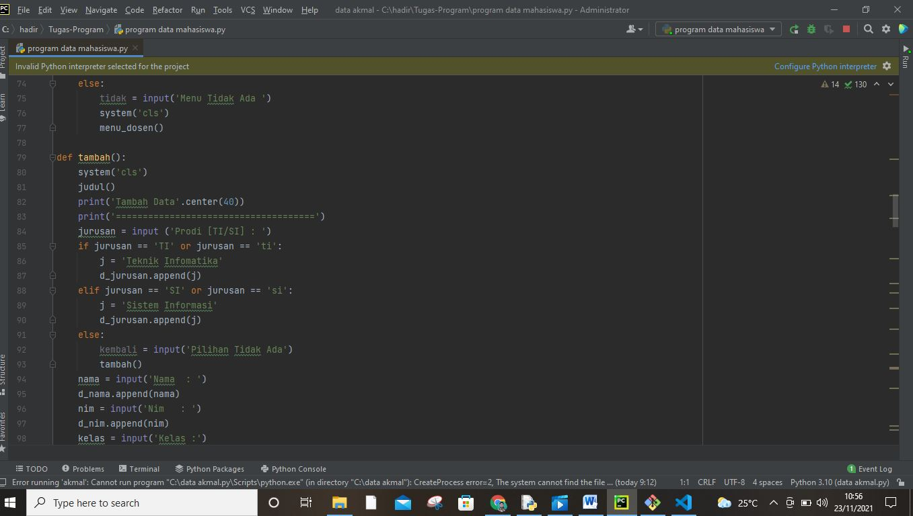

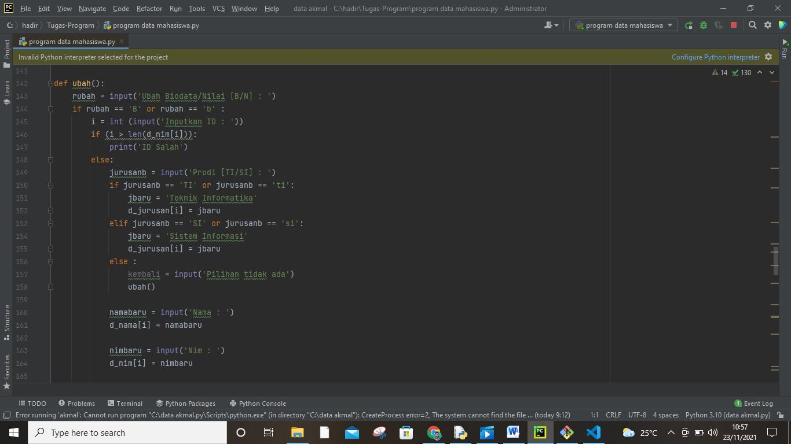
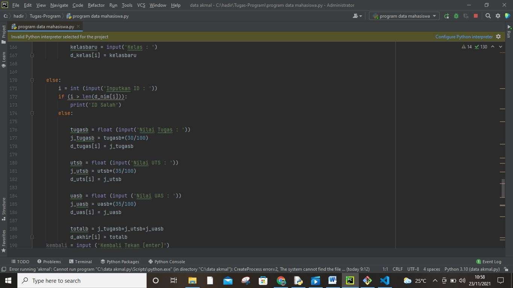
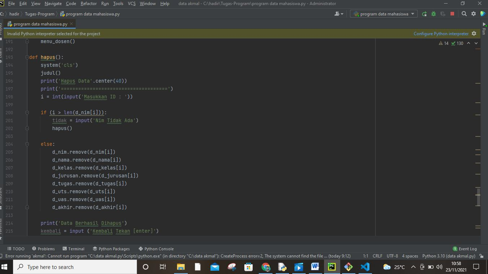
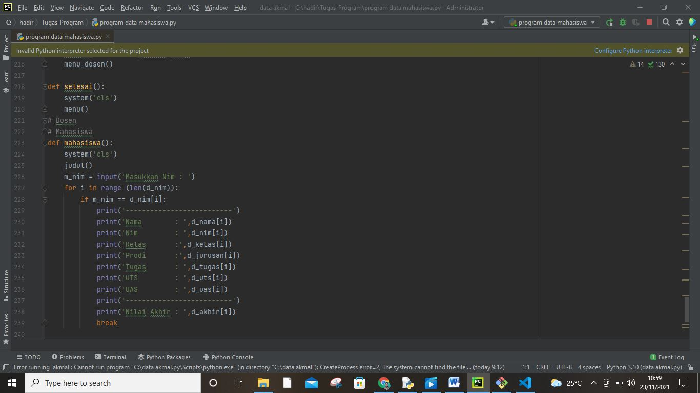
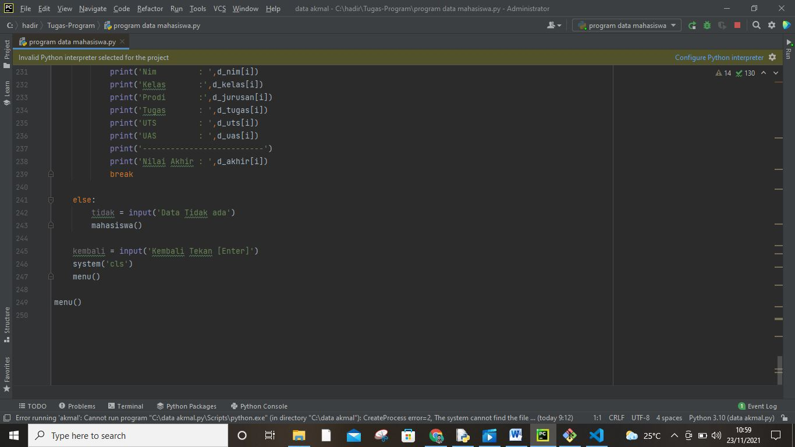
Tugas latihan pertemuan 9'
'
Buat sebuah list sebanyak 5 elemen dengan nilai bebas
• akses list:
• tampilkan elemen ke 3
• ambil nilai elemen ke 2 sampai elemen ke 4
• ambil elemen terakhir
• ubah elemen list:
• ubah elemen ke 4 dengan nilai lainnya
• ubah elemen ke 4 sampai dengan elemen terakhir
• tambah elemen list:
• ambil 2 bagian dari list pertama (A) dan jadikan list ke 2 (B)
• tambah list B dengan nilai string
• tambah list B dengan 3 nilai
• gabungkan list B'
'
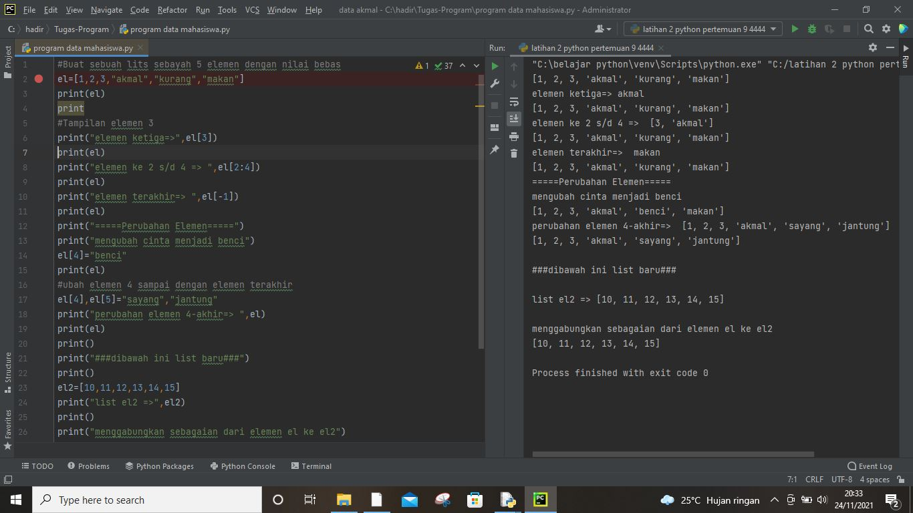
 
Dan untuk tambahan saya akan mebuat perogram sebagai berikut buat refrensi apabila program yg diatas masuh kurang sederhana semoga bermanfaat'
'

Program Sederhana Python Penambahan Data Ke Dalam List Buat program sederhana untuk menambahkan data kedalam sebuah list dengan rincian sebagai berikut :

1.)Program meminta memasukkan data sebanyak-banyaknya (gunakan perulangan) 2.)Tampilkan pertanyaan untuk menambah data(y/t?), apabila jawaban t(Tidak), maka program akan menampilkan daftar datanya. 3.)Nilai Akhir diambil dari perhitungan 3 komponen nilai (tugas: 30%, uts: 35%, uas: 35%) 4.)Buat flowchart dan penjelasan programnya'
'
Tampilan Rulling:'
'
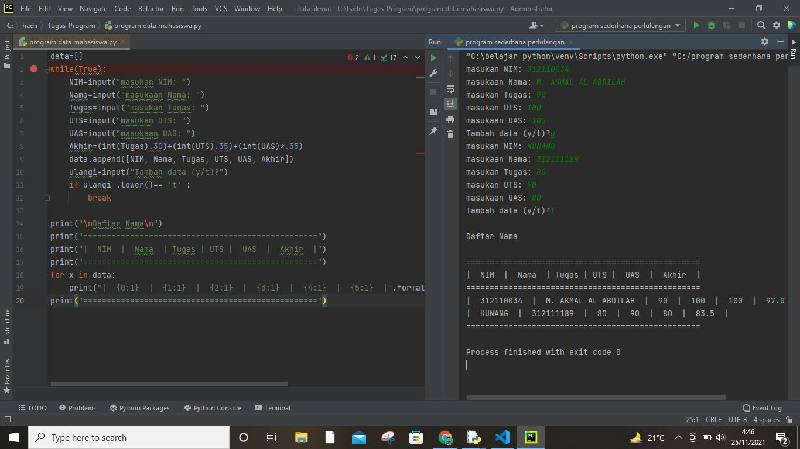
Scrip codingnnya:'
'
data=[]
while(True):
    NIM=input("masukan NIM: ")
    Nama=input("masukaan Nama: ")
    Tugas=input("masukan Tugas: ")
    UTS=input("masukan UTS: ")
    UAS=input("masukaan UAS: ")
    Akhir=(int(Tugas)*.30)+(int(UTS)*.35)+(int(UAS)*.35)
    data.append([NIM, Nama, Tugas, UTS, UAS, Akhir])
    ulangi=input("Tambah data (y/t)?")
    if ulangi .lower()== 't' :
        break

print("\nDaftar Nama\n")
print("==================================================")
print("|  NIM  |  Nama  | Tugas | UTS |  UAS  |  Akhir  |")
print("==================================================")
for x in data:
    print("|  {0:1}  |  {1:1}  |  {2:1}  |  {3:1}  |  {4:1}  |  {5:1}  |".format(x[0], x[1], x[2], x[3], x[4], x[5]))
print("==================================================")'
'

Alur Program atau Diagram Flowchartnya'
'
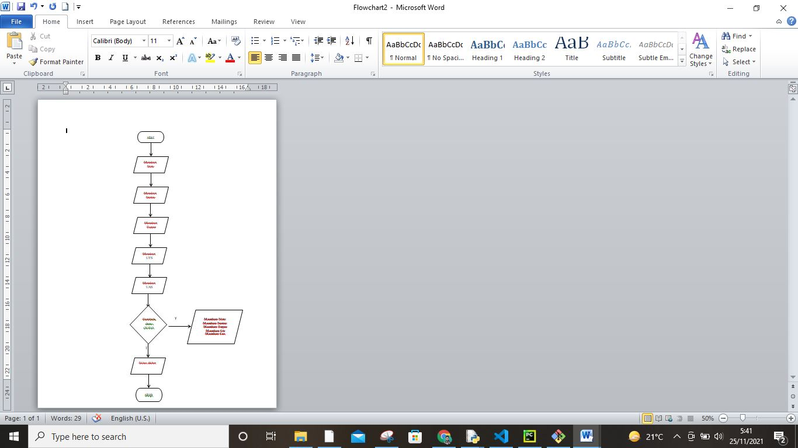

Segini saja untuk tugas kali, ini kurang lebihnya saya mohon maaf dan jika masih bannyak yang salah tolong dimaklum assalam'mualaikum wa romatullahi wa barokatuh'
'