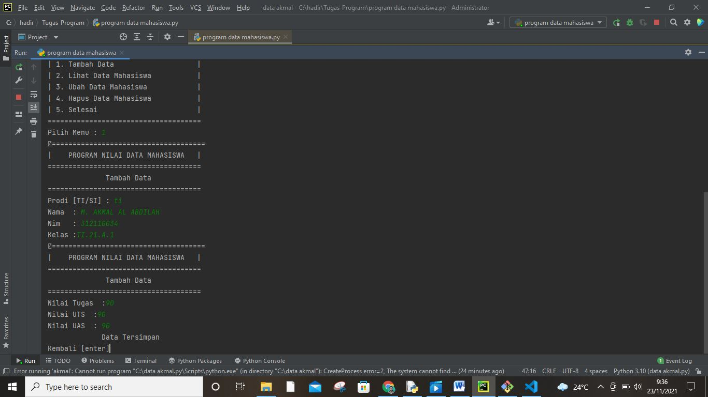

# hiu
## akmal
### Tugas-Program
#### belajar program sederhana
##### Program Python Nilai Data Mahasiswa , UTS, UAS, Tugas

Program python daftar mahasiswa dan perhitungan nilai 3 komponen (Tugas: 30&, uts:35%, uas:35%)'
'

1. Ruang Lingkup Program'
'
- Sintaks Dasar Python
- Operator Logika
- Percabangan
- Perulangan
- List & Tuple
- String & Bilangan
- Fungsi'
'
2. Rancangan Tampilan Input & Output'
'

3. Alur Program atau Diagram Flowchart'
'

4. Ketentuan Soal'
'
Tampilkan Menu halaman utara dengan pilihan : (Dosen dan Mahasiswa)
Menampilkan menu login Dosen dengan masukan kode (password = admin) untuk melanjutkan ke menu dosen.
Tampilkan menu Pilihan jika memilih menu dosen : ( Tambah Data, Lihat Data, Ubah Data, Hapus data)
Nilai Akhir diambil dari perhitungan 4 komponen nilai yaitu :         
Tugas          : 30%
UTS            : 35%
UAS            : 35%
Meliputi data (Nama,Nim,kelas,Prodi,Komponen nilai akhir)
Menampilkan Output di Menu Mahasiswa berupa (Nama, Nim, Kelas, Prodi, Komponen Nilai akhir)'
'
5. Coding Program dan scrip coding'
'

#Author by TeranixBQ|KodeTeks.com
from os import system
d_nama = []
d_nim = []
d_kelas = []
d_jurusan = []
d_tugas = []
d_uts = []
d_uas = []
d_akhir = []

def judul():
    print('=====================================')
    print('|    PROGRAM NILAI DATA MAHASISWA   |')
    print('=====================================')

def menu():
    judul()
    print('|                                   |')
    print('|      1. Dosen | 2. Mahasiswa      |')
    print('|                                   |')
    print('=====================================')
    print('*ketik 3 untuk keluar')
    print('-------------------------------------')
    menupilih = (input('Pilih Menu Login : '))

    if menupilih == '1':
        dosen()
    elif menupilih == '2':
        mahasiswa()
    elif menupilih == '3' :
        exit()
    else:
        system('cls')
        menu()

# dosen
def dosen():
    system('cls')
    print('=====================================')
    print('|               Login               |')
    print('=====================================')
    print('Masukkan kode Login')
    print('\n')
    kode = input('Masuk : ')
    if kode == 'admin' or kode == 'ADMIN':
        menu_dosen()
    else:
        salah = input('Kode salah')
        dosen()

def menu_dosen():
    system('cls')
    print('=====================================')
    print('Input Data Nilai Mahasiswa'.center(40))
    print('=====================================')
    print('| 1. Tambah Data                    |')
    print('| 2. Lihat Data Mahasiswa           |')
    print('| 3. Ubah Data Mahasiswa            |')
    print('| 4. Hapus Data Mahasiswa           |')
    print('| 5. Selesai                        |')
    print('=====================================')
    pilih2 = input('Pilih Menu : ')
    if pilih2 == '1':
        tambah()
    elif pilih2 == '2':
        lihat()
    elif pilih2 == '3':
        ubah()
    elif pilih2 == '4':
        hapus()
    elif pilih2 == '5':
        selesai()
    else:
        tidak = input('Menu Tidak Ada ')
        system('cls')
        menu_dosen()

def tambah():
    system('cls')
    judul()
    print('Tambah Data'.center(40))
    print('=====================================')
    jurusan = input ('Prodi [TI/SI] : ')
    if jurusan == 'TI' or jurusan == 'ti':
        j = 'Teknik Infomatika'
        d_jurusan.append(j)
    elif jurusan == 'SI' or jurusan == 'si':
        j = 'Sistem Informasi'
        d_jurusan.append(j)
    else:
        kembali = input('Pilihan Tidak Ada')
        tambah()
    nama = input('Nama  : ')
    d_nama.append(nama)
    nim = input('Nim   : ')
    d_nim.append(nim)
    kelas = input('Kelas :')
    d_kelas.append(kelas)

    system('cls')
    judul()
    print('Tambah Data'.center(40))
    print('=====================================')
   
    tugas = float(input('Nilai Tugas  :'))
    j_tugas = tugas*(30/100)
    d_tugas.append(j_tugas)

    uts = float(input('Nilai UTS  :'))
    j_uts = uts*(35/100)
    d_uts.append(j_uts)

    uas = float(input('Nilai UAS  : '))
    j_uas = uas*(35/100)
    d_uas.append(j_uas)

    total = j_tugas+j_uts+j_uas
    d_akhir.append(total)
    print ('Data Tersimpan'.center(40))
    kembali = input('Kembali [enter]')
    menu_dosen()

def lihat():
    system('cls')
    judul()

    for i in range (len(d_nim)):

        print('%d. Nama        : %s'%(i+0, d_nama[i]))
        print('    Nim         : %s'%d_nim[i])
        print('    Kelas       : %s'%d_kelas[i])
        print('    Prodi       : %s'%d_jurusan[i])
        print('    Tugas       : %.2f'%d_tugas[i])
        print('    UTS         : %.2f'%d_uts[i])
        print('    UAS         : %.2f'%d_uas[i])
        print('    Nilai Akhir : %.2f'%d_akhir[i])
        print('---------------------------')
    kembali = input('Kembali Tekan [enter]')
    menu_dosen()

def ubah():
    rubah = input('Ubah Biodata/Nilai [B/N] : ')
    if rubah == 'B' or rubah == 'b' :
        i = int (input('Inputkan ID : '))
        if (i > len(d_nim[i])):
            print('ID Salah')
        else:
            jurusanb = input('Prodi [TI/SI] : ')
            if jurusanb == 'TI' or jurusanb == 'ti':
                jbaru = 'Teknik Informatika'
                d_jurusan[i] = jbaru
            elif jurusanb == 'SI' or jurusanb == 'si':
                jbaru = 'Sistem Informasi'
                d_jurusan[i] = jbaru
            else :
                kembali = input('Pilihan tidak ada')
                ubah()

            namabaru = input('Nama : ')
            d_nama[i] = namabaru

            nimbaru = input('Nim : ')
            d_nim[i] = nimbaru

            kelasbaru = input('Kelas : ')
            d_kelas[i] = kelasbaru

            
    else:
        i = int (input('Inputkan ID : '))
        if (i > len(d_nim[i])):
            print('ID Salah')
        else:
           
            tugasb = float (input('Nilai Tugas : '))
            j_tugasb = tugasb*(30/100)
            d_tugas[i] = j_tugasb

            utsb = float (input('Nilai UTS : '))
            j_utsb = utsb*(35/100)
            d_uts[i] = j_utsb

            uasb = float (input ('Nilai UAS : '))
            j_uasb = uasb*(35/100)
            d_uas[i] = j_uasb

            totalb = j_tugasb+j_utsb+j_uasb
            d_akhir[i] = totalb
    kembali = input ('Kembali Tekan [enter]')
    menu_dosen()  

def hapus():
    system('cls')
    judul()
    print('Hapus Data'.center(40))
    print('=====================================')
    i = int(input('Masukkan ID : '))
    
    if (i > len(d_nim[i])):
        tidak = input('Nim Tidak Ada')
        hapus()
    
    else:
        d_nim.remove(d_nim[i])
        d_nama.remove(d_nama[i])
        d_kelas.remove(d_kelas[i])
        d_jurusan.remove(d_jurusan[i])
        d_tugas.remove(d_tugas[i])
        d_uts.remove(d_uts[i])
        d_uas.remove(d_uas[i])
        d_akhir.remove(d_akhir[i])
       
    print('Data Berhasil Dihapus')
    kembali = input ('Kembali Tekan [enter]')
    menu_dosen()

def selesai():
    system('cls')
    menu()
# Dosen
# Mahasiswa
def mahasiswa():
    system('cls')
    judul()
    m_nim = input('Masukkan Nim : ')
    for i in range (len(d_nim)):
        if m_nim == d_nim[i]:
            print('--------------------------')
            print('Nama        : ',d_nama[i])
            print('Nim         : ',d_nim[i])
            print('Kelas       :',d_kelas[i])
            print('Prodi       :',d_jurusan[i])
            print('Tugas       : ',d_tugas[i])
            print('UTS         : ',d_uts[i])
            print('UAS         : ',d_uas[i])
            print('--------------------------')
            print('Nilai Akhir : ',d_akhir[i])
            break
            
    else:
        tidak = input('Data Tidak ada')
        mahasiswa()
        
    kembali = input('Kembali Tekan [Enter]')
    system('cls')
    menu()

menu()'
'

Tugas latihan pertemuan 9'
'
Buat sebuah list sebanyak 5 elemen dengan nilai bebas
• akses list:
• tampilkan elemen ke 3
• ambil nilai elemen ke 2 sampai elemen ke 4
• ambil elemen terakhir
• ubah elemen list:
• ubah elemen ke 4 dengan nilai lainnya
• ubah elemen ke 4 sampai dengan elemen terakhir
• tambah elemen list:
• ambil 2 bagian dari list pertama (A) dan jadikan list ke 2 (B)
• tambah list B dengan nilai string
• tambah list B dengan 3 nilai
• gabungkan list B'
'

 
Dan untuk tambahan saya akan mebuat perogram sebagai berikut buat refrensi apabila program yg diatas masuh kurang sederhana semoga bermanfaat'
'

Program Sederhana Python Penambahan Data Ke Dalam List Buat program sederhana untuk menambahkan data kedalam sebuah list dengan rincian sebagai berikut :

1.)Program meminta memasukkan data sebanyak-banyaknya (gunakan perulangan) 2.)Tampilkan pertanyaan untuk menambah data(y/t?), apabila jawaban t(Tidak), maka program akan menampilkan daftar datanya. 3.)Nilai Akhir diambil dari perhitungan 3 komponen nilai (tugas: 30%, uts: 35%, uas: 35%) 4.)Buat flowchart dan penjelasan programnya'
'
Tampilan Rulling:'
'

Scrip codingnnya:'
'
data=[]
while(True):
    NIM=input("masukan NIM: ")
    Nama=input("masukaan Nama: ")
    Tugas=input("masukan Tugas: ")
    UTS=input("masukan UTS: ")
    UAS=input("masukaan UAS: ")
    Akhir=(int(Tugas)*.30)+(int(UTS)*.35)+(int(UAS)*.35)
    data.append([NIM, Nama, Tugas, UTS, UAS, Akhir])
    ulangi=input("Tambah data (y/t)?")
    if ulangi .lower()== 't' :
        break

print("\nDaftar Nama\n")
print("==================================================")
print("|  NIM  |  Nama  | Tugas | UTS |  UAS  |  Akhir  |")
print("==================================================")
for x in data:
    print("|  {0:1}  |  {1:1}  |  {2:1}  |  {3:1}  |  {4:1}  |  {5:1}  |".format(x[0], x[1], x[2], x[3], x[4], x[5]))
print("==================================================")'
'

Alur Program atau Diagram Flowchartnya'
'

Segini saja untuk tugas kali, ini kurang lebihnya saya mohon maaf dan jika masih bannyak yang salah tolong dimaklum assalam'mualaikum wa romatullahi wa barokatuh'
'